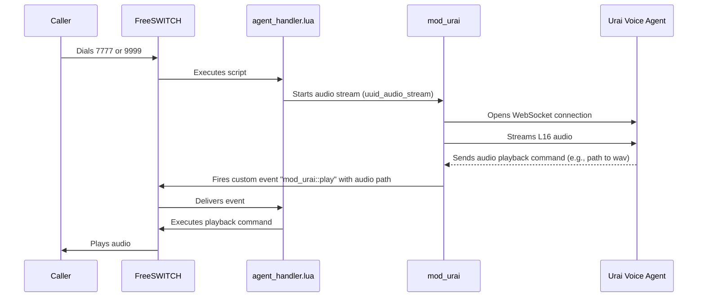

# mod_urai

A FreeSWITCH module that streams L16 audio from a channel to Urai's voice agent service.

### About

- The purpose of `mod_urai` was to provide a simple, low-dependency yet effective module for streaming audio and receiving responses from a websocket server.

## License

The FreeSWITCH configuration files (`.xml`) and Lua scripts (`.lua`) in this repository are licensed under the Apache License, Version 2.0. You can find a copy of the license in the `LICENSE` file.

However, the `mod_urai` FreeSWITCH module itself, which is distributed as a binary `.deb` package, is commercial software and is not covered by the Apache License. Please contact Urai AI Corp for licensing details regarding `mod_urai`.

## Installation

### Dependencies

This is meant to be installed on a FreeSwitch 1.10x installation on Debian 12. It depends on
`lua5.3`, `liblua5.3-dev` and `luarocks`.

Once that is installed  you can install the deb module from the releases.

```bash
dpkg -i path_to_deb
```


## Call plan

Refer to the `conf` directory for a minimal freeswitch config. The dialplan is configured in `conf/dialplan/default.xml`.

There are three extensions configured:

- **8888**: An echo test. Whatever you say will be repeated back to you.
- **7777**: Connects to a remote Urai voice agent. This uses the `urai_remote_api_key` variable from `conf/vars.xml`.
- **9999**: Connects to a local Urai voice agent. This uses the `urai_api_key` variable from `conf/vars.xml`.

### How it works

When a call is routed to extension `7777` or `9999`, the `agent_handler.lua` script is executed. This script is responsible for managing the call and interacting with `mod_urai`.

The `mod_urai` module handles the WebSocket connection lifecycle. It streams audio from the caller to the Urai voice agent and receives commands back. When `mod_urai` receives a command to play audio, it fires a custom FreeSWITCH event (`mod_urai::play`).

The `agent_handler.lua` script listens for these events. When it catches a `mod_urai::play` event, it executes a `playback` command to play the specified audio file to the caller.

This architecture decouples the WebSocket communication (handled by `mod_urai`) from the call control logic (handled by `agent_handler.lua`).

Here is a diagram visualizing the flow:


